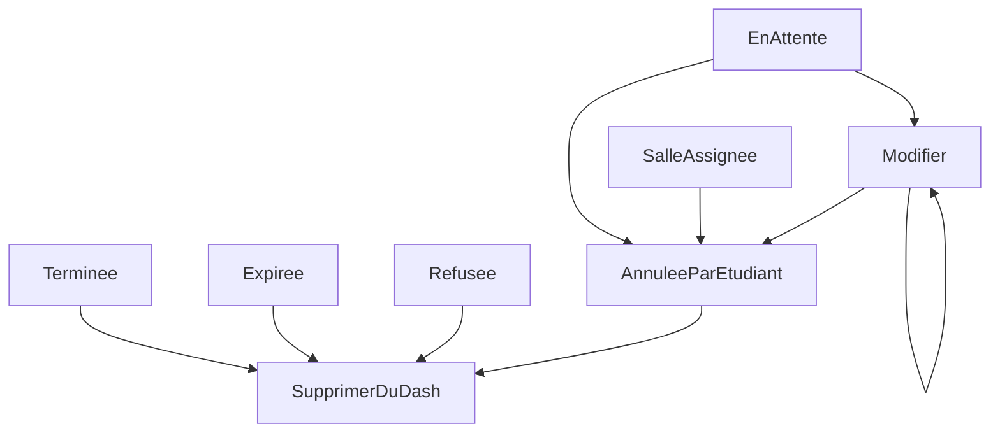

### Diagramme du workflow des demandes pour l'étudiant


## Composantes du projet

### Objet Invoice

 - updatedAt - Date
 - Date - Date
 - Total - Integer
 - client - String
 - Status - String -> receptacle du workflow


**Les status sont des entiers**

1 : en attente 

2: répondu par un tuteur

3 : salle assignée 

4 : terminée 

5: expirée 

6 : Refusée 

7 : Annulation par l’étudiant 

8 : Modifier 

9 : Supprimer 


Doctrine: 

Pour mettre à jour sa base de données et la mettre en cohérence avec Doctrine :

````shell
php bin/console doctrine:schema:update --force
````

Pour s'assurer de vider le cache de Doctrine 
```shell
php bin/console doctrine:cache:clear-metadata
```


### A faire absolument pour run le projet 
````shell
docker compose create 
````
````shell
symfony console doctrine:migrations:migrate
````

````shell
symfony console doctrine:fixtures:load
````

````shell
symfony serve -d
'''